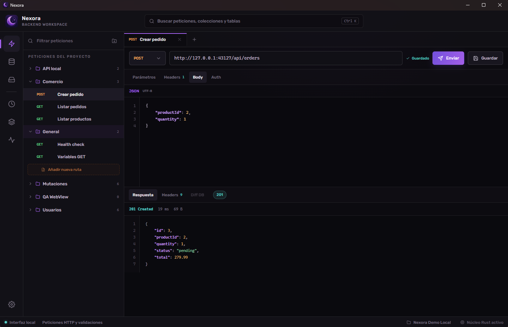
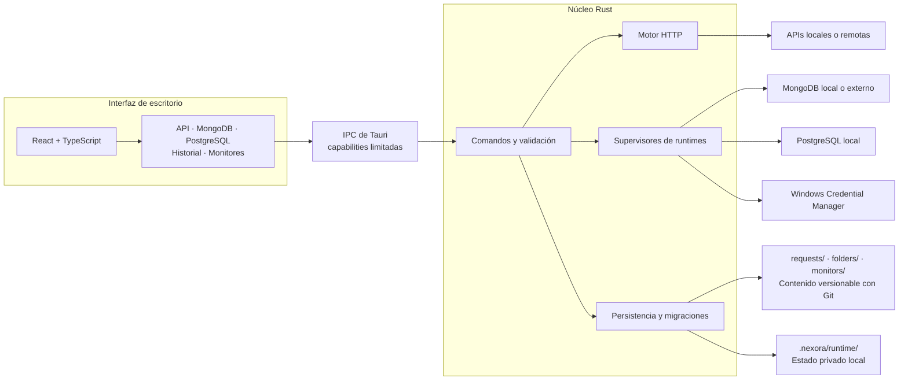

<p align="center">
  
</p>

<h1 align="center">Nexora</h1>

<p align="center">
  Desarrollo backend local, privado y preparado para trabajar con Git en Windows.
</p>

<p align="center">
  <a href="https://github.com/Roger08G/nexora/actions/workflows/ci.yml"></a>
  <a href="https://github.com/Roger08G/nexora/releases"></a>
  <a href="https://github.com/Roger08G/nexora/stargazers"></a>
  <a href="https://github.com/Roger08G/nexora/network/members"></a>
  
  
  
  
  <a href="LICENSE"></a>
</p>

Nexora es una aplicación de desarrollo backend local-first que reúne un cliente de APIs REST, un
workspace MongoDB y un workbench PostgreSQL. Cada proyecto mantiene sus pruebas y definiciones en
archivos revisables con Git, mientras los datos, credenciales y runtimes permanecen exclusivamente
en local.



## Arquitectura

Nexora separa la interfaz React del núcleo nativo. Toda operación con red, archivos, credenciales o
bases de datos atraviesa comandos Tauri validados y limitados mediante capabilities.



## Funciones

- Shell de escritorio modular con navegación entre espacios de trabajo.
- Selector inicial para abrir la carpeta raíz de un proyecto Nexora o crear uno nuevo.
- Cliente REST con ejecución HTTP real, status, headers, body, duración y tamaño de respuesta.
- Rutas, carpetas y monitores visibles en la raíz, con un JSON por recurso para obtener diffs claros en Git.
- Carpetas persistentes, menú contextual para renombrar o eliminar rutas y guardado automático.
- Pestañas de ruta cerrables con `Ctrl+W` sin permitir cerrar la última petición abierta.
- Historial HTTP local con búsqueda, repetición y limpieza controlada.
- Monitores locales configurables, ejecución manual o periódica y registro en el historial.
- MongoDB local administrado por proyecto y conexión opcional a servidores externos.
- Consulta de MongoDB, creación de colecciones e inserción, edición y borrado de documentos.
- Inspección de esquemas e índices MongoDB.
- PostgreSQL 18.6 local administrado por proyecto, con esquemas, tablas, editor SQL y exportación CSV.
- Variables de sesión para resolver `{{referencias}}` sin guardar secretos en el proyecto.
- Búsqueda global con `Ctrl+K` para módulos, peticiones, colecciones y tablas cargadas.
- Ajustes locales persistentes y notificaciones Sonner para las operaciones principales.
- Transición SilkWave durante la carga del proyecto, ajustada al tamaño de sus datos locales.
- Diseño adaptable, navegación accesible y soporte para movimiento reducido.

Las escrituras PostgreSQL requieren confirmación y las lecturas se ejecutan dentro de una
transacción de solo lectura. El workbench utiliza el rol limitado `nexora_app`, separado del rol
administrativo interno. MongoDB exige filtros no vacíos para editar o borrar, y las URI externas
solo viven durante la sesión. El núcleo limita tiempos, respuestas HTTP, filas SQL, documentos
MongoDB y conexiones simultáneas para mantener estable la aplicación.

Todavía no forman parte de esta versión los workflows API → diff de base de datos, la importación de
cURL/OpenAPI/Postman ni la ejecución de monitores cuando Nexora está cerrado.

## Tecnologías

- Tauri 2 y Rust.
- React 19 y TypeScript.
- Vite y Bun.
- WebGL nativo para la animación SilkWave de inicio.

## Estructura

```text
src/
├── app/       # arranque, providers, configuración y shell
├── modules/   # páginas, componentes, servicios y tipos por dominio
└── shared/    # componentes, servicios, hooks, estilos y tipos reutilizables

src-tauri/src/
├── commands/ # proyectos, HTTP, MongoDB y PostgreSQL
├── error.rs  # errores serializables para IPC
└── state.rs  # clientes, conexiones y supervisores de runtimes en memoria
```

Las importaciones internas utilizan el alias `@/`.

## Desarrollo

Requisitos: Bun y el toolchain estable de Rust.

```bash
bun install
bun run dev
```

`bun run dev` solo previsualiza la interfaz. Para usar diálogos, proyectos y motores nativos debe
ejecutarse `bun run tauri dev`.

## Formato de proyecto

```text
mi-proyecto/
├── .nexora/              # integración interna con la aplicación
│   ├── .gitignore        # excluye runtime/
│   ├── project.json      # identidad y versión del proyecto
│   └── runtime/          # datos de motores e historial local
├── folders/              # metadatos versionables de las carpetas
│   └── general.json
├── monitors/             # definiciones versionables, nunca incluyen secretos
│   └── monitor-<uuid>.json
└── requests/             # pruebas de API versionables
    └── general/
        └── request-<uuid>.json
```

Las carpetas `folders/`, `monitors/` y `requests/` se pueden versionar directamente y revisar sin
depender de Nexora. `.nexora/` queda reservado para la comunicación con la aplicación y su estado
local. Al abrir un proyecto creado con la versión 0.1, Nexora migra las definiciones ocultas al
nuevo formato; si ya existe un archivo distinto en el destino, cancela la migración para evitar
sobrescribir datos.

Los archivos de petición guardan referencias como `Bearer {{token}}`, no el valor de `token`.
Al ejecutar, Nexora resuelve variables en URL, nombres y valores de query y headers, y body. Las
referencias incompletas o sin valor producen un error antes de enviar tráfico. Nexora bloquea
credenciales directas o parcialmente ocultas en URLs, headers —también desactivados—, parámetros y
campos sensibles de bodies JSON o formularios.

El historial conserva un máximo de 500 ejecuciones en `.nexora/runtime/`, que está ignorado por Git. Solo
registra método, ruta sin query ni credenciales, estado y métricas; no persiste variables de sesión,
headers, cuerpos de petición ni cuerpos de respuesta. Los monitores ejecutan peticiones guardadas
mientras Nexora permanece abierto y utilizan los valores de sesión que existan en ese momento.

## MongoDB local administrado

En Windows, Nexora busca MongoDB Community Server 8.3.8 en:

```text
%LOCALAPPDATA%\Nexora\runtimes\mongodb\8.3.8\mongod.exe
```

El proceso se inicia oculto en `127.0.0.1` con un puerto libre, autenticación habilitada y datos
aislados en `.nexora/runtime/mongodb`. Nexora crea una credencial distinta por proyecto y guarda la
contraseña en Windows Credential Manager; no la escribe en Git ni la expone en la interfaz. Al
desconectar o cerrar Nexora, el proceso administrado se detiene.

La variable `NEXORA_MONGOD_PATH` permite utilizar otro ejecutable durante desarrollo. No se debe
versionar `mongod.exe` dentro del repositorio.

## PostgreSQL local administrado

Nexora utiliza el ZIP de binarios para Windows publicado por EDB y enlazado desde PostgreSQL.org.
Busca PostgreSQL 18.6 en:

```text
%LOCALAPPDATA%\Nexora\runtimes\postgresql\18.6\pgsql\
```

No se importan archivos SQL ni bases SQLite. Al iniciar el espacio PostgreSQL, Nexora crea un
clúster real en `.nexora/runtime/postgresql`, lo enlaza exclusivamente a `127.0.0.1` en un puerto
libre y prepara la base `nexora`. Cada proyecto tiene una contraseña aleatoria almacenada en Windows
Credential Manager. Los datos, logs y credenciales quedan fuera de Git.

El rol `nexora_admin` queda reservado para la inicialización y el mantenimiento interno. Las
consultas de la interfaz utilizan `nexora_app`, sin privilegios de superusuario, creación de roles o
bases de datos ni pertenencia al rol administrativo. Los clústeres creados por versiones alpha
anteriores se migran al abrirse: Nexora crea el rol limitado y reasigna los objetos del proyecto sin
eliminar sus datos. En esos clústeres, `nexora_local` puede conservarse como bootstrap interno de
PostgreSQL, pero nunca se utiliza ni se expone como conexión del workbench.

La variable `NEXORA_POSTGRESQL_HOME` permite indicar otra distribución completa durante desarrollo;
debe apuntar a la carpeta que contiene `bin`, `lib` y `share`.

## Verificación

```bash
bun run fmt:check
bun run audit:frontend
bun run typecheck
bun run build
cargo fmt --manifest-path src-tauri/Cargo.toml --check
cargo clippy --manifest-path src-tauri/Cargo.toml --all-targets --all-features -- -D warnings
cargo test --manifest-path src-tauri/Cargo.toml --all-targets
cargo build --manifest-path src-tauri/Cargo.toml --release
cargo audit --file src-tauri/Cargo.lock
```

La suite E2E abre el binario de depuración en el WebView real de Tauri mediante WebdriverIO. Crea
un proyecto Nexora y una API Bun temporales, comprueba la interfaz y ejecuta operaciones reales
contra los runtimes locales de MongoDB y PostgreSQL. Al terminar detiene los procesos y elimina el
proyecto de prueba.

```bash
bun run test:e2e
```

Para repetir solo la suite sobre un binario E2E ya compilado:

```bash
bun run test:e2e:run
```

En Windows, estas pruebas requieren WebView2 y los binarios locales de MongoDB y PostgreSQL
descritos arriba. La característica Rust `e2e` y los permisos WebDriver están aislados en la
configuración `src-tauri/tauri.e2e.conf.json`; no se incluyen en el binario normal de producción.

Las pruebas reales de los runtimes son opcionales porque requieren sus binarios y Windows Credential
Manager:

```bash
cargo test --manifest-path src-tauri/Cargo.toml runs_an_authenticated_project_database_end_to_end -- --ignored
cargo test --manifest-path src-tauri/Cargo.toml runs_managed_postgresql_end_to_end -- --ignored
cargo test --manifest-path src-tauri/Cargo.toml migrates_the_legacy_superuser_to_the_limited_application_role -- --ignored
```

GitHub Actions ejecuta en Windows las comprobaciones de formato, TypeScript, build frontend,
auditorías de Bun y RustSec, Clippy, tests Rust, compilación con la característica WebView y build de
Tauri. Dependabot revisa cada semana las dependencias de Bun, Cargo y GitHub Actions.

La auditoría frontend actualiza dependencias transitivas vulnerables y verifica mediante una ZIP
maliciosa de regresión el parche local aplicado a `extract-zip`, cuyo upstream todavía no ofrece una
versión corregida.

## Aplicación de escritorio

```bash
bun run tauri dev
bun run tauri build
```

Nexora funciona sin cuentas, nube ni telemetría. Los proyectos y sus rutas de API permanecen en
local y se pueden versionar con Git sin incluir los valores de las variables de sesión.

## Seguridad

Consulta [SECURITY.md](SECURITY.md) para conocer las versiones soportadas, el alcance y el proceso
de reporte coordinado. No publiques vulnerabilidades, pruebas de concepto ni datos sensibles en un
issue o pull request.

## Licencia

Nexora se distribuye bajo la [licencia MIT](LICENSE).
